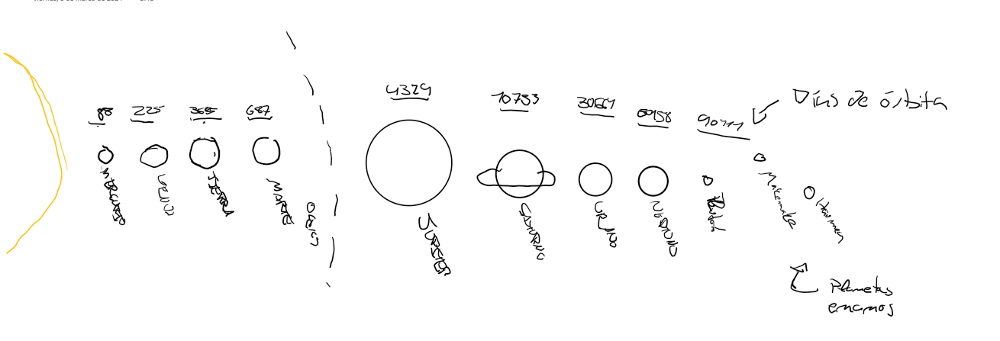
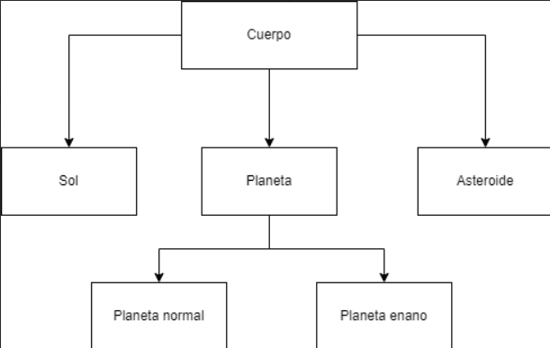

# INTROSPECTIVA SOBRE EL UNIVERSO
### Una obra de arte digital creada por Patricia Rodriguez y Beñat Ramirez

## Idea

El proyecto cosiste en una resprestación de nuestro sistema solar, trantando de representar de la manera más fiel posible el tiempo que tarda un planeta tanto en rotar sobre si mismo como alrededor del sol.
También tendremos otros objetos de menor importancia como anillos de asteroides, planetas enanos y meteoritos, que tendrán menor nivel de detalles.

## Funcionalidades

- Calcular la velocidad de órbita de un planeta dándole un centro y el tiempo que necesita para orbitar ese centro
- Crear lunas con órbitas aleatorias proporcionando un número de lunas
- Ajustar la velocidad con la que pasa el tiempo, para acelerar la simulación

## Dibujo

## Diagrama de clases

